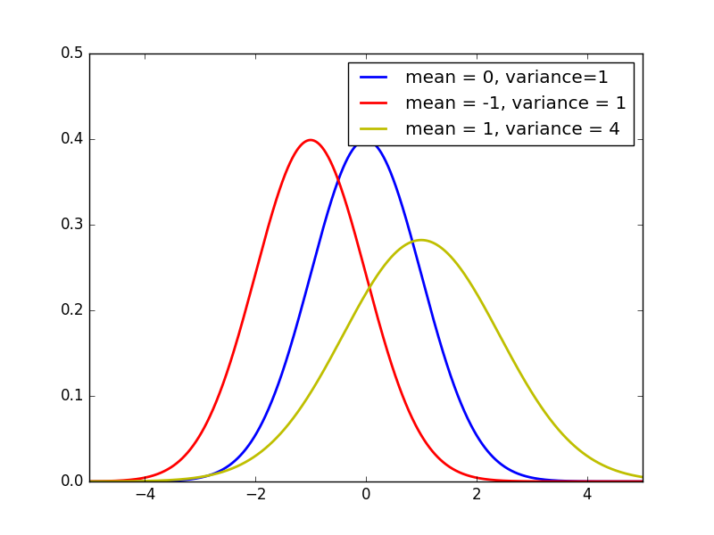
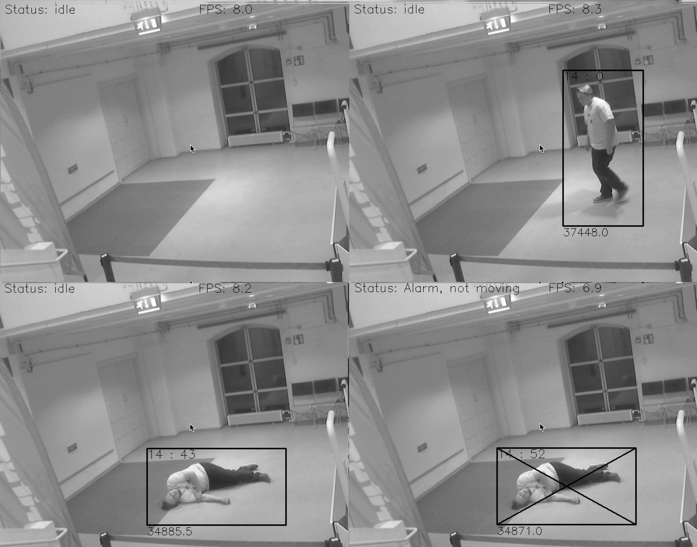
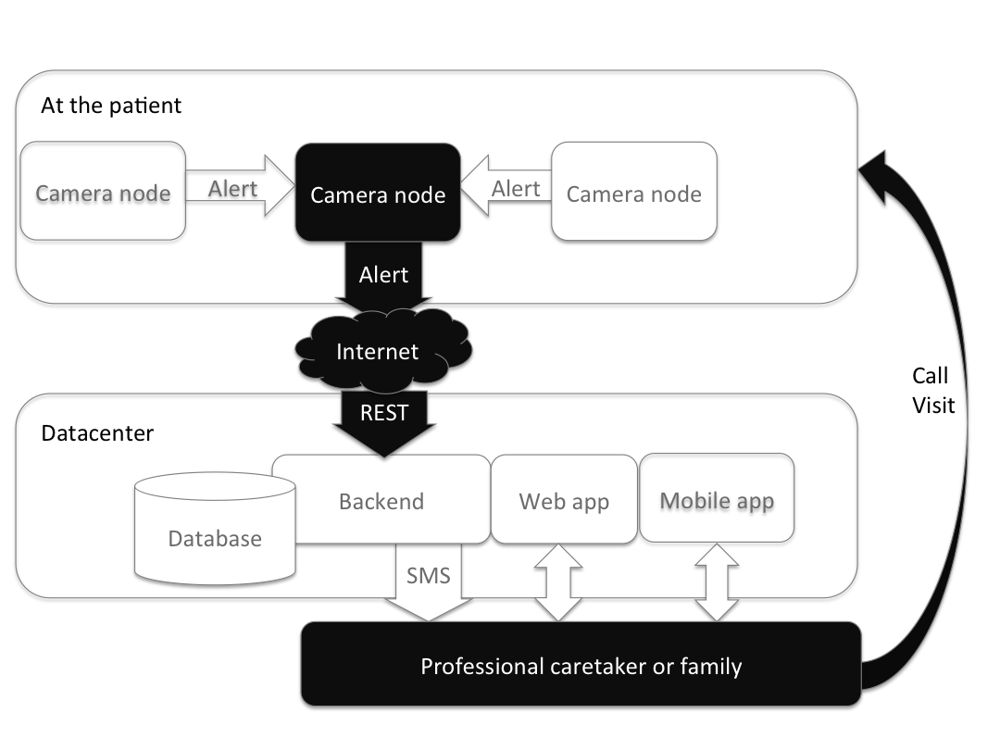
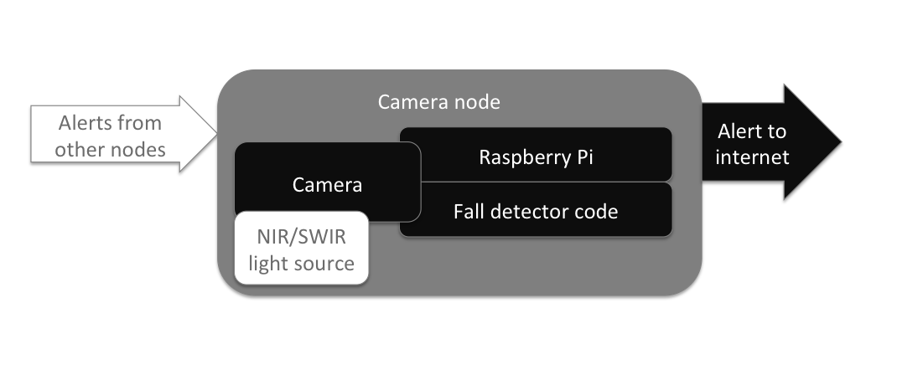

# Thesis - Improving safety for home care patients with a low cost computer vision solution

The world has a problem: hospitals are filling up. That is why elderly people need to live longer at home. But they need to do so safely. This is problematic because they are afraid of falling. They need automatic monitoring to feel safe at home. This thesis proposes an automatic monitoring system for formal and informal home care patients and care centers. The proposed system will provide security and a feeling of safety by detecting when a resident suffers from a fall. This feeling of safety can increase the persons ability to perform daily routines at home. After the detection the system will be able to alert professional personnel or family. The proposed system is affordable. This system uses computer vision to detect persons and their actions. The patient does not need to remember to put the detector on, charge it or anything else, which is really convenient for the target group that suffers from dementia. This solution also does not need costly installations or costly hardware.

If you are reading this in paper format please consider reading it in your browser where links work at: <https://github.com/infr/falldetector-public/>

* Improving safety for home care patients with a low cost computer vision solution
* Name: Kim Salmi
* E-Mail: kim.salmi[at]iki.fi
* Student number: a1204035
* Supervisor: Tero Karvinen
* Haaga-Helia University of Applied Sciences, Finland
* Project website: <http://tunn.us/arduino/falldetector.php>
* Keywords: opencv, computer vision, machine vision, fall detector, python, raspberry pi, home care

- - -

# Table of Contents - Suggestion

* 1 Abbreviations
* 2 Introduction
	* 2.1 Background
	* 2.2 About this thesis
	* 2.3 Goals of the study
* 3 Theoretical frame
	* 3.1 Home care
	* 3.2 Active and Assistive living 
	* 3.3 Automatic monitoring
		* 3.3.1 Video analysis
			* 3.3.1.1 Terminology
			* 3.3.1.2 Non-adaptive backgrounding
			* 3.3.1.3 Adaptive backgrounding
			* 3.3.1.4 Modern methods
			* 3.3.1.5 Challenges in backgrounding
		* 3.3.2 Action detection
			* 3.3.2.1 Static approach
			* 3.3.2.2 Dynamic approach
			* 3.3.2.3 Motion
			* 3.3.2.4 Combination
			* 3.3.2.5 Behavior analysis
			* 3.3.2.6 Physiological monitoring
		* 3.3.3 Evaluation of monitoring methods
* 4 Constructive research
	* 4.1 Fall detector v1
		* 4.1.1 Backgrounding method
	* 4.2 Fall detector v2
		* 4.2.1 Backgrounding method
	* 4.3 Infrastructure
	* 4.4 Software design
	* 4.5 Future steps
* 5 Discussion
* 6 References
* 7 Appendix
	* 7.1 Timetable for the thesis
	* 7.2 Project plan - Linux project (ICT4TN018 Haaga-Helia course)
	* 7.3 Fall detector installation
	* 7.4 The code for fall detection v1
	* 7.5 The code for fall detection v2

- - -

# Abbreviations

AAL - Active and Assistive living

ADL - Activities of daily living

ADL/IADL - ADL and IADL combined, ability to function at home

AGMM - Adaptive Gaussian mixture model

GMM -  Gaussian mixture model

IADL - Instrumental activities of daily living

MOG2 - A variation of Zivkovic (2004 & 2006) AGMM, included in OpenCv

OpenCV - Open Source Computer Vision, a library aimed for real-time computer vision

VAAL - Video based solutions for Active and Assistive living


- - -

# Introduction

## Background

Year 2012 world population was 7.2 billion. In the year 2100 world population is estimated to be between 9.0 and 13.2 billion. (Gerland, Ratrely, et al. 2014) In the beginning of the 20th century life expectancy was perhaps 30 years, a hundred years later it has raised to 65 years (Cohen 2003, 1173-1174). The decline of child mortality (death before the fifth birthday) has had a big impact on life expectancy but a five-year olds life expectancy has still increased significantly within the last century. Higher ages mortality patterns have also changed. Today a 50-year old is expected to live over 20 years longer than in 1845. (Roser 2016) In the coming half century, as a result of these factors, we will see dramatic population aging. By year 2050 the global fraction of population aged 65 years or older will rise from 7% (year 2010) to 16% (Cohen 2003, 1173-1174). In the year 2050 we will have four times more over 60 years old year than in the year 2000. The rising amount of elderly population will generate stress in our health care system. (Ropponen 2012, 8) This raises the question how will we be able to take care of the aging generations? Some of the solutions are discussed further in this paper.

## About this thesis

This thesis proposes an automatic monitoring system for formal and informal home care patients and care centers. It will provide security and a feeling of safety by detecting when a resident fall. After the detection the system will be able to alert professional personnel or family. The system should be affordable and should not be significantly less accurate than other available options. Further in this thesis the system will be called automatic fall detector.

There will be code examples written in Python using the OpenCV library. The code examples are tested with Python version 2.7.11 and OpenCV version 2.4.13. Code examples should work in Python 2.7.x and OpenCV 2.4.x. The examples can be found at [Github](https://github.com/infr/falldetector-public/tree/master/example%20code). The code examples can be tested with [example.py](example%20code/example.py). The code is licensed under GPLv3.

This thesis consist of two parts. The first part will cover the theoretical frame. The theoretical frame will give necessary background information from the health care perspective for understanding the need for automatic monitoring in general. It will also cover the technical part for automatic video analysis. The main topics will be home care, European Unions active and assistive living programme, automatic monitoring, video analysis in general, backgrounding and action detection.

The goal of this project is to build a prototype that could be productized and commercialized. The code will be available publicly at Github. The second part will include the a summary of how the system was developed.

## Goals of the study

The main idea is to create an embedded solution for improving the safety of patients at home care.

Research questions are:

- How to create a fall detection system to monitor home care patients?
	- How to create a software that detects falling
		- How to detect humans and track them
		- How to detect problems
		- Can it be done with just one camera or is more needed?
	- How to keep the system unit cost low (< 200€)
	- How to handle the privacy?

- - -

# Theoretical frame

## Home care

Home care is one solution for easing the stress for the health care system. It is a supportive care provided to people with special needs at their home. Depending on the need, home care can be provided multiple times a day and in many countries it is available around the clock. (Sanerma 2009) The concept has grown considerably. The practice is helping the society by minimizing hospital care by moving the action to the home of the patient. Home care can also be assumed to increase the patients quality of life and maintenance of independence. (Thome, Dykes & Hallberg 2003; Sanerma 2009)

The home care term is used for **formal care**; *home care which is provided by professionals* and **informal care**; *home care which is provided by non-professionals*. Formal care can also be defined as home health care. Informal care can also be defined as domiciliary care, non-medical care or custodial care. Informal care is usually provided by family or friends. The definitions is dependent on the countries health care system and their common practices. (Sanerma 2009) Further in this research the terms informal care and formal care will be used. The term home care will be used as a umbrella for both informal care and formal care.

Formal care can be divided in four different categories. *Practical* - Preparing food, cleaning and shopping. *Personal* - Personal hygiene and helping the patient get dressed. *Monitoring / supervision* - Monitoring patients suffering from dementia. *Care / Case management* - Coordinating the patients services. The needed formal care is determined by measuring *activities of daily living* (ADL) and *instrumental activities of daily living* (IADL). ADL contains eating, personal hygiene, putting on clothes and transferring (in the house). IADL contains preparing meals, housework, managing medications and managing finance. (Sanerma 2009) Patients usually rate their abilities to function at home (ADL/IADL) higher than the professional care takers would. Only the fear of falling is a bigger concern for patients than the professionals would rate it. (Morrow-Howell, Proctor & Rozario, 2001)

There are many technological solutions available for patients living at their home. Monitoring and security solutions can be utilized by family and professional care takers. There should always be the patients consent before bringing such equipment to their home. Patients privacy should be respected when they open their home to others. (Cardinaux, Bhowmik, Abhayaratne & Hawley 2011; Sanerma 2009; Stengård 2011) Patients with memory disorders can have problems adapting to new things in their home. Foreign objects and strange environment usually cause anxiety. Therefore it is crucial to install such equipment there before the patients memory is starting to fail. (Kotilainen, Topo, Hurnasti 2009; Stengård 2011)

Sanerma (2009) and Stengård (2011) both agree that one of the big problems in home care with is that care takers do not have enough time for each patient. Automatic monitoring could free resources for the care takers.

Kangasniemi and Andersson (2016) made a cautious estimation that 20% of the care takers work, in Finnish hospitals, could be automatically performed by currently available technology. They estimated that some monotonous tasks could be performed by robots or by automation and would give more time to spend on tasks that can only be performed by humans. They estimated that a this would not affect care takers employment because of the rising amount of elderly population. Implementation of the technologies needed would take 2-3 years.

## Active and Assistive living

European Union (EU) has noticed the growth of life expectancy and the problems it will bring to the health care system. EU/European Commission have established funding programs to support research and global competitiveness since 1984, currently in the European Research Area (ERA). The funding programs are called Framework Programmes for Research and Technological Development and currently run at phase eighth. Horizon 2020 or Framework Programme 8 (FP8) is currently in progress with an estimated budget of 80 billion euros. (Grove 2011) One of the funded projects is Active and Assistive Living (AAL).[^1] With a 700 million euros budget, AAL is trying to enhance the quality of life for the older people while improving the industry in Europe with the help of technology. (AAL - Active and Assistive Living programme 2016) Industry and research has shown growing interest in video based solutions for AAL (VAAL). Technology has evolved to a state that products are being commercialized. (Cardinaux et al. 2011)

[^1]: Renamed in 2014 when FP8 started. A lot of the literature references to the old name Ambient Assisted Living (AAL) Joint Programme (2008-2013).

## Automatic monitoring

When elderly people fall it is particularly serious and often leads to injury or death. That is why automatic monitoring has an important role in home care and care centers. (Rubentein & Josephson 2002; Kroputaponchai & Suvonvorn 2013) The fear of falling leads to restricted ADL/IADL. The fear is justified, fall related injuries are among the five most causes of death for the elderly population. Even if the count of falls would be smaller than a child would have, falling is much more dangerous for older persons with e.g. slower protection reflexes. If falls would be detected the patient could be provided with in-time medical treatment. (Lin & Ling 2007; Rubentein & Josephson 2002) A long lie after the fall is a poor prognostic sign. (Rubenstein 2002). In-time medical treatment could minimize the damage and save lives. The presence of personnel brings an elderly patients the feeling of safety (Sanerma 2009). Could the presence of an automatic fall detecting system also lower the fear and therefore increase ADL/IADL?

One of the methods to automatically monitor persons and their activities is utilizing sensors. These can be *body-worn sensors* or *embedded sensors* installed to the environment. Embedded sensors generally need a large network of sensors. They could be placed on every door to detect when it does open or close. (Cardinaux et al. 2011) Or as Ropponen (2012) suggested sensors could be mounted in to the floor. These embedded systems are usually costly to maintain and the installation or relocation of them can be time-consuming. Embedded sensors are also highly sensitive to the performance of the sensor. Body-worn sensors could monitor falling, activity, vital signs, etc. and they do it quite effectively. In body-worn sensors user compliance is poor and they do not work if the patient forgets to wear them. Help buttons can be useful but are useless if the person is unconscious or is not able to move. Fall detection could also be made with floor vibration sensors, sound monitoring or video monitoring. Sound monitoring could detect when something hits the floor and also identify speech to identify a cry for help. These methods could also be combined to get the advantages of all systems. (Cardinaux et al. 2011; Lin & Ling 2007; Rougier et al. 2007)

Video based monitoring has some advantages, one single camera could monitor one room and pick up most of the activities in that room. Also the installation of a robust system could be easy. There are still some barriers to overcome, mostly around the patients concerns about their privacy. (Cardinaux et al. 2011)

Traditional video surveillance systems need an operator to track activities with a video displaying multi-monitor setup. All the recording occur centralized and there is a complete lack of privacy. There need to be a paid operator watching the screens over the surveillance period. On top of this there is a study showing that after 22 minutes the operator will miss 95% of the activities on the screen. (Fleck & Straßer 2010)

One of the biggest concerns for the patients is about how they preserve their privacy. Some of them are not agreeable with installation of cameras and sensors in their home. The main concern is the loss of privacy and particularly in solutions that includes cameras. (Cardinaux et al. 2011) This is why the privacy concerns, in such a system, should be taken seriously.

There are different technologies available for processing video material in a secure way. The video can be filtered and obscured so that identities or activities can not be recognized. A silhouette can be placed over the humans in the video so that they can not be identified. (Cardinaux et al. 2011)

For the reasons presented above the proposed solution will be a smart camera system. A smart camera system is a privacy respecting solution. In the system there are multiple camera nodes. Each camera node can analyze the video automatically and detect falls. The cameras will not transfer the video to any centralized system and thus preventing loss of privacy. (Fleck & Straßer 2010) In the proposed solution no human is able to see the video. If the camera detects a fall it will alarm the personnel or family. The alarm can be made with different solutions and are discussed further later in this thesis.

### Video analysis

Video analysis can be made with a lot of different methods. Usually the interesting part of a scene is not the background but the objects in the foreground. These objects of interest could be any object, e.g. humans, cars, animals etc. *Foreground detection* is a method where objects of interest are separated from the background in a video stream. This method can also be called *background subtraction*. Further in this thesis both terms will be used. Background subtraction works by thresholding the error between the current image and the estimate of the image without the objects of interest. (Xu, et al. 2016; Chan, Mahadevan, Vasconcelos 2010; Stauffer & Grimson 1999) Faster computers have enabled researchers to propose robust models that are more complex than the previous methods. Backrounding methods can be categorized into pixel-based, region-based, hybrid methods and also into parametric and non-parametric methods. Every method has its own strength and weakness. (Xu, et al. 2016; Vacavant & Sobral 2014; Stauffer & Grimson 1999) In this thesis we can not cover every available algorithms but we will discuss the most significant. Basic terminology of the methods will be discussed next.

#### Terminology

A video consists usually of a series of bitmap digital images that are called frames. Each frame consists of a matrix of pixels. In a binary image each pixels has 1-bit of information indicating either foreground or background (black or white, 0 or 1). A grayscale image could have an 8-bit number for each pixel indicating how bright it is. Color images can use RGB color space indicating values for red, green and blue separately. These color models can be divided to additive (e.g. HSV, HSL) and subtractive models (e.g. CMYK) and they can contain an alpha channel for determine the opacity of a pixel. HSV stands for hue, saturation and value. HSL stands for hue, saturation and lightness. CMYK, which is used in print, stands for cyan, magenta, yellow and key (black). (Granholm 2015)

Each frame can be denoted as I(x, y) where x and y are coordinates of the pixels position. (Granholm 2015) I(x, y, t) can be used in a video to determine a frame at the specific time (t).

Image segmentation is a process where the frame is divided into multiple segments. These segments are created with labeling each pixel according to their shared characteristics, such as value or position. These methods can be divided in to region-based and pixel-based methods. More specifically these labeling techniques can use e.g. inter-pixel relations, edge detection or histograms. With the help of the labels it is easier to further process a single or multiple frames. (Srinivasan & Shobha 2007, Xu et al. 2016)

#### Non-adaptive backgrounding

If the background of a scene remains unchanged the detection of foreground objects would be easy (Vacavant & Sobral 2014; Langanière 2011, 266-277). Let us assume that each frame is converted to a grayscale image before it is processed. Basically a frame (I), at the time (t), when there is no foreground objects in the scene (empty room, road without cars) is declared as the *background model* and then each pixel value (P) is compared to the pixel value at the same coordinate (x, y), in the frame, at a specific time. Each pixel that is different from the background model would be declared as foreground (F).  (Tamersoy 2009) In Fig. 1 let us assume the first frame (t=0) has no foreground objects. This method can be tested with Fig. 1b.

> P[F(x,y,t)] = P[I(x,y,t)] - P[I(x,y,0)]

Fig. 1 - Static Frame Difference

```python
# Kim Salmi kim.salmi(at)iki(dot)fi http://tunn.us/arduino/falldetector.php
# 2016 License: GPLv3
# Fig. 1b - Static Frame Difference
import cv2
import sys
camera = cv2.VideoCapture(0)
backgroundFrame = camera.read()[1]
backgroundFrame = cv2.cvtColor(backgroundFrame, cv2.COLOR_BGR2GRAY)
while 1:
	currentFrame = camera.read()[1]
	currentFrame = cv2.cvtColor(currentFrame, cv2.COLOR_BGR2GRAY)
	foreground = cv2.absdiff(backgroundFrame, currentFrame)
	cv2.imshow("backgroundFrame", backgroundFrame)
	cv2.imshow("foreground", foreground)

	key = cv2.waitKey(1) & 0xFF
	if key == ord("q"):
		cv2.destroyAllWindows()
		camera.release()
		sys.exit()
```

Fig. 1b - Static Frame Difference in Python

In a real life scenario pixel values in the background would not be exactly the same in each frame because of changes in illumination, dynamic background, shadows and video noise (Xu et al. 2016; Stauffer & Grimson 1999; Langanière 2011, 266-277). An attempt to fix this could be thresholding. If the absolute difference between pixels is greater than the threshold, it is declared as foreground. (Fig. 2) This method can be tested with Fig. 2b where the static threshold is set to 100 on a scale of 0-255. Foreground is set to the value 255 which equals white color and the background is set 0 which equals black color.

> P[F(x,y,t)] = |P[I(x,y,t)] - P[I(x,y,0)]| > Threshold

Fig. 2 - Static Frame Difference with threshold (Tamersoy 2009)

```python
# Kim Salmi kim.salmi(at)iki(dot)fi http://tunn.us/arduino/falldetector.php
# 2016 License: GPLv3
# Fig. 2b - Static Frame Difference with threshold
import sys
import cv2
threshold = 100
camera = cv2.VideoCapture(0)
_, backgroundFrame = camera.read()
backgroundFrame = cv2.cvtColor(backgroundFrame, cv2.COLOR_BGR2GRAY)
while 1:
	_, currentFrame = camera.read()
	currentFrame = cv2.cvtColor(currentFrame, cv2.COLOR_BGR2GRAY)
	foreground = cv2.absdiff(backgroundFrame, currentFrame)
	foreground = cv2.threshold(foreground, threshold, 255, cv2.THRESH_BINARY)[1]
	cv2.imshow("backgroundFrame", backgroundFrame)
	cv2.imshow("foreground", foreground)

	key = cv2.waitKey(1) & 0xFF
	if key == ord("q"):
		cv2.destroyAllWindows()
		camera.release()
		sys.exit()
```

Fig. 2b - Static Frame Difference with threshold in Python

Here is an example of *traditional backgrounding* or *non-adaptive backgrounding*. We have Fig. 3 as a background model and we calculate the pixel value difference from Fig. 4. (do not mind the green boxes) with a threshold. The result is shown in Fig. 5 and then the green boxes in Fig. 4 are drawn. In this example we see a problem with the reflection from the window, it is declared as foreground (Fig. 4). If the threshold is too low it will create *false negative* outputs and if it is too high it will create *false positive* outputs.


Fig. 3 - Empty room


Fig. 4 - Closet opened


Fig. 5 - Closet threshold (in this example there is a Gaussian blur adapted to the image)

Non-adaptive backgrounding has other challenges too, it needs re-initialization (updating of the entire background model) or otherwise changes in the background is detected as foreground. These problems make non-adaptive backgrounding only useful in highly-supervised tracking applications. (Stauffer & Grimson 1999) The re-initialization could be avoided by using the previous frame as the background model (Fig. 6), but this fails if the foreground object suddenly stops (Vacavant & Sobral 2014). This can be tested with Fig 6b.

> P[F(x,y,t)] = |P[I(x,y,t)] - P[I(x,y,t-1)]| > Threshold

Fig. 6 - Frame Difference

```python
# Kim Salmi kim.salmi(at)iki(dot)fi http://tunn.us/arduino/falldetector.php
# 2016 License: GPLv3
# Fig. 6b - Frame Difference
import cv2
import sys
threshold = 100
camera = cv2.VideoCapture(camera)
_, backgroundFrame = camera.read()
backgroundFrame = cv2.cvtColor(backgroundFrame, cv2.COLOR_BGR2GRAY)
while 1:
	_, currentFrame = camera.read()
	currentFrame = cv2.cvtColor(currentFrame, cv2.COLOR_BGR2GRAY)
	foreground = cv2.absdiff(backgroundFrame, currentFrame)
	foreground = cv2.threshold(foreground, threshold, 255, cv2.THRESH_BINARY)[1]
	cv2.imshow("backgroundFrame", backgroundFrame)
	cv2.imshow("foreground", foreground)
	backgroundFrame = currentFrame
	
	key = cv2.waitKey(1) & 0xFF
	if key == ord("q"):
		cv2.destroyAllWindows()
		camera.release()
		sys.exit()
```

Fig. 6b - Frame Difference in Python

#### Adaptive backgrounding

*Adaptive backgrounding* is a method where the background model is created using averaging images over time (1...n). (Fig. 7) The method can be memory consuming. (Tamersoy 2009) This method is effective where objects move continuously and the background is visible a significant portion of the time. This is not a robust solution because slowly moving objects are adapted to the background model and thus lost from the foreground. This solution also recovers slowly, can not handle bimodal backgrounds, does not handle lightning changes and has just one shared predetermined threshold for every pixel in the image. (Stauffer & Grimson 1999; Tamersoy 2009) A variation of this method can be tested with Fig. 7b.

> P[F(x,y,t)] = |P[I(x,y,t)] - P[mode{I(x,y,t-1), ..., I(x,y,t-n)}]| > Threshold

Fig. 7 - Adaptive backgrounding

```python
# Kim Salmi kim.salmi(at)iki(dot)fi http://tunn.us/arduino/falldetector.php
# 2016 License: GPLv3
# Fig. 7b - A variation of adaptive backgrounding with median
import sys
import cv2
threshold = 10
camera = cv2.VideoCapture(0)
_, backgroundFrame = camera.read()
backgroundFrame = cv2.cvtColor(backgroundFrame, cv2.COLOR_BGR2GRAY)
i = 1
while 1:
	_, currentFrame = camera.read()
	currentFrame = cv2.cvtColor(currentFrame, cv2.COLOR_BGR2GRAY)
	foreground = cv2.absdiff(backgroundFrame, currentFrame)
	foreground = cv2.threshold(foreground, threshold, 255, cv2.THRESH_BINARY)[1]
	cv2.imshow("foreground", foreground)
	alpha = (1.0/i)
	backgroundFrame = cv2.addWeighted(currentFrame, alpha, backgroundFrame, 1.0-alpha, 0)
	cv2.imshow("backgroundFrame", backgroundFrame)
	i += 1

	key = cv2.waitKey(1) & 0xFF
	if key == ord("q"):
		cv2.destroyAllWindows()
		camera.release()
		sys.exit()
```
Fig. 7b - A variation of adaptive backgrounding with median in Python

#### Modern methods

Modern background subtraction solutions are expected to be robust. Robust solutions should handle objects overlapping, shadows, lightning changes, moving background elements, objects of interest entering or leaving the scene, even when they are slow-moving. Traditional approaches usually fail in these conditions. (Chan et al. 2010; Stauffer & Grimson 1999)

Generally all the modern algorithms share the same pattern (Vacavant & Sobral 2014): 

1. *Background initialization*: Creating the background model from a fixed number of frames
2. *Foreground detection*: Comparing the background model to the current frame or frames
3. *Background maintenance*: Teaching / updating the background model. Return to step 2.

> Normal distribution also called Gaussian distribution is a continuous probability distribution. It is determined N(μ, σ^2) where μ is the mean or expectation and σ^2 is the variance. μ controls the location of the peak of the distribution and σ^2 controls how wide the curve is. (Fig. 8) The Central Limit Theorems states that averages of random variables that are added together, all having the same probability distribution, tends towards Gaussian (or normal distribution) as the number of variables increases. (Lyon 2014)

> 
	
> Fig. 8 - Normal distribution

Successful early work in the field on human tracking was made by Wren et al. (1997) who proposed *PFinder* ("person finder"). In this, pixel-based method, the background model is a single Gaussian per pixel and the tracked object have a multi-class statistical model (Wren et al. 1997). This has been proved to be a good background subtraction method (Vacavant & Sobral 2014; Stauffer & Grimson 1999). However a single Gaussian per pixel is not able to adapt quickly to a dynamic background (swaying trees, waves in the ocean).

Because the background can change, short and long term, Stauffer and Grimson (1999) proposed the *Gaussian mixture model* (GMM). The GMM models every pixel with a mixture of K Gaussians function. GMM is able to quickly adapt to a dynamic background and it has become a very popular background subtraction method. However GMM is not able to handle sudden illumination changes (turning on/off lights, clouds blocking sunlight) and shadows very well. (Chan, Mahadevan, Vasconcelos 2010; Vacavant & Sobral 2014; Xu et al. 2016) Zivkovic (2004) proposed improvements to GMM with *Adaptive Gaussian mixture model* (AGMM). These improvements did not include a solution for the shadow problem but reduced processing time by automatically selecting the number of components needed for each pixel. This research was funded by EU Framework Programme 6 (FP6 2002-2006). (Zivkovic 2004)

Xu et al. (2016) tested a series of modern background subtraction methods:

| Paper | Method |
| --- | --- |
| Stauffer & Grimson (1999) | Gaussian mixture model (GMM) |
| Elgammal et al. (2000) | Kernel denisty estimator (KDE) |
| Kim et al. (2004) inspired from Kohonen | CodeBook |
| Zivkovic (2006) | improved GMM with Adaptive Gaussian mixture model (AGMM) |
| Wang et al. (2007) | Consensus-based method (SACON) |
| Maddalena and Petrosino 2008 | a self-organizing background subtraction method (SOBS) |
| Barnich and Droogenbroeck (2011) | a universal background subtraction algorithm (Vibe) (*This method is patented*) |
| Hoffmann et al. (2012) | Pixel-based adaptive segmenter (PBAS) |

Cardinaux et al. (2011) listed a series of methods in their research:

| Paper | Method |
| --- | --- |
| Cucchiara et al. (2003) | Statistical approach updating the background model with information from the previous frames about moving objects, shadows and ghost objects. |
| Stauffer and Grimson (1999) | GMM |
| Elgammal et al. (2000) | KDE |
| Eng et al. (2004) | A Bayesian framework for challenging conditions - background and foreground share the same color or when two foreground objects overlap each other. |

OpenCV have libraries ready for the following methods (OpenCV - cv::BackgroundSubtractor Class Reference):

| Paper | Method | Class in OpenCV |
| --- | --- | --- | --- |
| Zivkovic 2006 | K-nearest neigbours - Background/Foreground Segmentation Algorithm | cv::BackgroundSubtractorKNN | 
| Zivkovic 2004 & 2006 | Gaussian Mixture-based Background/Foreground Segmentation Algorithm | cv::BackgroundSubtractorMOG2 |
| Zivkovic 2004 | Gaussian Mixture-based Background/Foreground Segmentation Algorithm | cv::cuda::BackgroundSubtractorMOG2 |
| Godbehere, Matsukawa & Goldberg 2012 | Background Subtractor module - Takes a series of images and returns a sequence of mask (8UC1) images of the same size, where 255 indicates Foreground and 0 represents Background | cv::bgsegm::BackgroundSubtractorGMG | 
| KaewTraKulPong & Bowden 2002 | Gaussian Mixture-based Background/Foreground Segmentation | cv::bgsegm::BackgroundSubtractorMOG |
| Li , Huang, Gu & Tian 2003 | The class discriminates between foreground and background pixels by building and maintaining a model of the background. Any pixel which does not fit this model is then deemed to be foreground. |cv::cuda::BackgroundSubtractorFGD | 
| Godbehere, Matsukawa & Goldberg 2012 | Background/Foreground Segmentation - The class discriminates between foreground and background pixels by building and maintaining a model of the background. Any pixel which does not fit this model is then deemed to be foreground. | cv::cuda::BackgroundSubtractorGMG | 
| KaewTraKulPong & Bowden 2002 | Gaussian Mixture-based Background/Foreground Segmentation - The class discriminates between foreground and background pixels by building and maintaining a model of the background. Any pixel which does not fit this model is then deemed to be foreground. |  cv::cuda::BackgroundSubtractorMOG |
| KaewTraKulPong & Bowden 2002 | Gaussian Mixture-based Background/Foreground Segmentation - The class discriminates between foreground and background pixels by building and maintaining a model of the background. Any pixel which does not fit this model is then deemed to be foreground. | cv::cuda::BackgroundSubtractorMOG | 

In order to choose the perfect background subtraction method for the fall detection system proposed it is crucial to determinate what features are needed and what challenges the method has to handle. Challenges in backgrounding is discussed next.

#### Challenges in backgrounding

As mentioned earlier the biggest challenges in backgrounding would be *illumination*, *dynamic background*, *shadows* and *video noise*. One of the challenges is that the RGB color space is sensitive to illumination changes. For this reason SOBS uses the HSV color space and SACON normalized color space. CodeBook separates color distortion and brightness distortion with a color model. Rapid illumination changes can occur when someone turn on a light or sunlight is blocked by some clouds. KDE combines a short and long term background model to handle rapid illumination changes. (Xu et al. 2016)

Usually every video feed has noise. The source of this noise can be e.g. sensor noise, compression artifacts or camera shaking. One technique to minimize the effects of noise is to adapt a Gaussian or median filter to the video stream. Another technique is to construct the background model from noisy pixel values so that the model will automatically adapt to noise. Vibe uses this method to construct the background model. Robust backgrounding methods should be able to cope with noise disturbance. (Xu et al. 2016)

Foreground object often cast a shadow. A shadow from a foreground object will affect the backgrounds illumination. Usually shadowed areas have a minor color variation, but a significant illumination variation. This creates challenges for backgrounding methods and a robust method should be able to handle shadows. (Xu et al. 2016)

### Activity detection

One of the reasons why one would like to detect foreground objects from a video is to be able to determinate what activity the person in the video is performing. In the *static analysis* the persons posture is analyzed at a specific time. A posture is a good indicator of what the person is doing e.g. lying, standing or sitting. This information alone is not very useful. That is why in the *dynamic analysis* the outcome of the static approach is combined to the earlier static approach outcomes. In this way we can analyze movement patterns. (Cardinaux et al. 2011) If the person was standing in the last frame and in the current frame is detected as lying, the person probably have suffered from a fall (Cardinaux et al. 2011; Kroputaponchai & Suvonvorn 2013).

#### Static analysis

The static approach tries to detect in what posture the target person is. This analysis is done frame-wise (for each frame separately). Posture of a person is a good indication of the persons state. *Aspect ratio measurement* is a simple and quick way to analyze a persons posture. It is used in many fall detection algorithms (Fleck & Straßer 2010; Lin & Ling 2007; Nasution & Emmanuel 2007). Aspect ratio is calculated using the foreground pixels of a person, that are obtained with a background subtraction, to determinate in what position the person is. The persons *bounding box* is constructed by finding the furthest foreground pixels (leftmost, rightmost, topmost, bottommost). Shadows and noise can cause errors in the bounding box calculations. To avoid this there can be a histogram applied row-wise and column-wise and then the bounding box would be constructed for the pixels that exceed the histograms threshold. Horizontal and vertical projection histograms can decrease the effects of noise and shadows. (Cardinaux et al. 2011)

Nasution & Emmanuel (2007) proposed a k-Nearest Neighbor (KNN) algorithm to identify the most similar posture from the postures that were trained to the algorithm during the training phase.

Rougier et al. (2007) proposed the usage of an *approximated ellipse* instead of a bounding box to estimate the persons posture. This method can extract the orientation of a person better than the bounding box.

#### Dynamic analysis

Because the static approach alone is not very useful a dynamic approach is used. In the dynamic analysis the results from the static analysis are used and saved to a register. With the register the system can identify if a lying person did fall or intentionally lying. The time since a person detected as standing to the time that the person is detected lying is used to identify falls. (Cardinaux et al. 2011)  If the person was standing 0.4-0.8 seconds ago and is now detected as lying, the person probably have suffered from a fall. Also an audio analysis could be utilized with video-based methods to make the detection more robust. (Cardinaux et al. 2011; Kroputaponchai & Suvonvorn 2013)

Nasution & Emmanuel (2007) proposed usage of a stripped GMM to detect foreground objects. To detect the activity of a person they then trained the system with sitting, standing, bending, lying and lying against the camera. After the training phase they adapted a KNN algorithm to calculate equality with each posture from the training phase. After this they adapted an evidence accumulation technique to only change the posture (from last frame) if the equality was high enough to exceed a threshold. (Nasution & Emmanuel 2007)

Lin & Ling (2007) found three features that usually occur when a person falls. The incident will happen in a *short time period*, typically in a range of 0.4-0.8 seconds. The persons *centroid changes* rapidly and significantly. The *vertical projection* of the person changes significantly. (Lin & Ling 2007)

Rougier et al. (2007) used a *Motion History Image* (MHI) to determine if a person is falling or performing some other activity. In the MHI pixel intensity represents the recent motion. This method rely on the assumption that falls will have a high motion. As the background subtraction method Rougier et al. (2007) used an improved CodeBook proposed by Kim et al. (2004).

Many researches define a fall as a person having a greater acceleration than in their normal daily activities (Gjoreski, Lustrek, Gams 2012; Kroputaponchai & Suvonvorn 2013; Nasution & Emmanuel 2007). Fall-like activities can have the same acceleration as normal activities such as lying down on the bed quickly or quickly sitting down. Additionally, all falls does not include a fast acceleration. (Gjoreski et al. 2012; Rubenstein 2002; Rougier et al. 2007) Gjoreski et al. (2012) proposed that Rubenstein (2002) showed that 22% of the falls could be "slow falls", falls that does not have a greater acceleration than normal activities. That is why approaches that only rely on acceleration can be problematic and could cause many false detections. A robust system should detect slower falls and be able to separate quick normal activities from falls.

#### Position and motion analysis

While posture analysis is a good way to detect the persons state it is hard for it to detect what activity, more specific than just sitting, standing or lying, the person is performing. That is why the persons position could be used to determine what ADL or IADL the person is currently performing. With this technique the daily routines could be monitored and taught to the system and if something abnormal is detected, it could create an alarm (Rougier et al. 2007; OMASeniori; Lin & Ling 2007).

The persons position analysis with an overhead camera could extract the following information: *position*, *velocity* and *orientation*. This could be done by tracking the persons head. The head tracking can be made with an approximated ellipse to extract information of height changes i.e. how close to the camera is the person. Motion and position information is useful for making decisions of activities. (Cardinaux et al. 2011) Unusual inactivity could also be detected (Lin & Ling 2007). Position based limitations could be defined to turn off the fall detection on zones where falls could be normal (Rougier et al. 2007). If a person is detected as falling on to the sofa and then detected as sitting, the person could be intentionally sitting. Another example could be that it is not normal behavior for a person to be lying on the floor but the person can lye down on the bed.

Rougier et al. (2007) used the persons motion after a detected fall to determine if a fall was bad enough that it should create an alert.

#### Combination

Because presented methods does not always achieve the sensitivity needed for a robust system these methods could be combined.

Rougier et al. (2007) combined the output of MHI (to detect if there was enough motion), orientation and ratio of the ellipse (to detect a possible fall) and lastly if there were little or none motion after the fall. If all these conditions were true, a detection of a fall was created.

The results from static analysis, dynamic analysis, position and motion analysis can be combined with simple AND or OR rules. The final decision could also be generated with combining each output and the certainty of it as a weighted result to create a maybe more robust solution. (Cardinaux et al. 2011)

#### Behavior analysis

As earlier mentioned daily routines could be taught to the system and abnormal activity could be noticed. These activities could include sleep patterns, exiting the facility, falls, immobility, ADL and IADL. Most of the activities could be extracted from the position and motion analysis. (Rougier et al. 2007; OMASeniori; Lin & Ling 2007; Cardinaux et al. 2011)

#### Physiological monitoring

Cardinaux et al. (2011) presented physiological video monitoring papers including monitoring breathing and monitoring cardiac pulse (multiple persons, with a webcam, [sic] while the head is moving). Even if these solutions would be useful, they fall out of this papers scope. But these techniques should be considered for further improvements.

### Evaluation of monitoring methods

The performance of different techniques can be evaluated on multiple levels. *Technical performance* can be evaluated with measuring the following classifiers: *true positive (TP)* when a fall is present and the fall is detected, *true negative (TN)* when there is no fall and no detection of a fall, *false positive (FP)* when there is no fall but a fall is detected (false alarm) and *false negative (FN)* when a fall is present but there is no detection (miss). With the technical performance evaluation different techniques can be compared.

Other evaluation targets could be the *outcome* evaluation that aims to determine the effect on users and others involved, *privacy protection* evaluation that aims to ensure the level of security and *user acceptability* evaluation that aims to determine how well users will approve the presented method. (Cardinaux et al. 2011)

# Constructive research 

This thesis consist of two parts. This is the second part of the thesis. Two different software prototypes were developed, one that could be implemented as it is (v1) and the second prototype (v2) that will be able to monitor more features but needs further development so that it could function independently. After describing the key features of the two systems there will be an explanation of the infrastructure and how the software works.

The source code is available at [Github](https://github.com/infr/falldetector-public). There are demo videos available at [tunn.us](http://tunn.us/arduino/falldetector2.php). In the appendix there are step-by-step instructions to install and test this solution on a Raspberry Pi.

## Fall detector v1

The first version of the fall detector utilizes sort of a dynamic approach. It will detect if a person is not moving or is moving too little in a specific time period. Detections could be configured so that there are different detection times for e.g. sitting on the sofa or lying in the bed and if the person is lying on the floor not moving the detection could be triggered in a few minutes. When the detection is made it will send an alarm to a RESTful web service. This web service can trigger different functions from a centralized alarm center. These functions include information to professional care takers and family.

### Backgrounding method

The first version of the fall detector uses a simple adaptive backgrounding method such as the one seen in Fig 7. As preprocessing the background method does make the frame gray scale and resizes it smaller so that the foreground can be detected faster. This backgrounding method is not able to handle illumination changes quickly. This method can identify and track movement of multiple objects at the same time.

## Fall detector v2

The second version of the fall detector is an improvement to the first version. Fig. 9 presents a debugging windows from the system. In the first image, on top left, is from a empty room with nothing detected. In the second image there is a person, who is detected. The second image shows a bounding box around the person. This bounding box has three different values. In the image value 14 is just for debugging purposes as it is the person id that keeps track of different persons if there are multiple of them in the scene. The second value 0 is the alarm counter that will start if the person is not moving over the threshold. The third value is the size of the bounding box. The size information is for debugging purposes. The minimum allowed size of bounding boxes can be set in the settings so that minimal objects wont count as persons in the scene. In the third image this person has suffered from a fall, this does not yet trigger the alarm but by lying on the floor not moving enough has started the alarm counter, which is currently 43. In the fourth picture the system has raised an alarm because the person has not moved enough to reset the counter for the alarm and the counter has reached 50, which was set as threshold in this test.


Fig. 9 - Debugging view of fall detector v2

### Backgrounding method

OpenCv has it own library ready for an variation of Zivkovic (2004 & 2006) AGMM (MOG2). This method was chosen for the second version as the backgrounding method for reasons presented earlier. One substantial reason was Xu et al. (2016) did show that AGMM performed good in their tests. It can also detect shadows which was considered as a good thing in this case.

## Infrastructure

In Fig. 10 the infrastructure of this system is presented. The components with a darker background are presented in this paper. The camera node detects a person having a problem, this process is later discussed in more detail. After the detection the camera node sends an alert, via internet, to a backend, via a RESTfull API. The camera node never transmits any video feed or photo to ensure the patients privacy.

When an alarm is raised to the backend it will inform the professional care taker or family about the problem. The professional care taker or the family can then try to call the patient and see if everything is clear. If no one answers the phone they should probably visit the facility where the patient lives.


Fig. 10 - Infrastructure

In Fig. 11 the camera node is presented. The camera node consists of Raspberry Pi 3 Model B and a camera attached to it. A Raspberry Pi and a generic camera is currently costing around 50€ (Farnell element14 2016). This generic camera sends its video feed to the Raspberry Pi that is running fall detector v1 or v2 and analyzing the video to detect different types of problems. All the computation is made in the Raspberry Pi 3 Model B. Currently it detects if a person is not moving enough (over the threshold). When the detection is made it will send an alarm. 


Fig. 11 - Camera node

## Software design

This section will explain how the software works in a technical way. Fall detector v1 and v2 works technically in the same way but v1 has less features included. That is why v2 functionality will be explained. The software is written in Python using the OpenCV library. The code is tested with Python version 2.7.11 and OpenCV version 2.4.13. Code should work in Python 2.7.x and OpenCV 2.4.x. The code is licensed under GPLv3.

[main.py](fall-detector-v2/main.py) - is the main loop. This main loop starts the software and keeps it running while calling different functions in the video class.

[video.py](fall-detector-v2/video.py) - Video class - utilizes the video feed. It is able to capture frames from the feed, call different background subtraction features, take keyboard inputs for changing settings (these can be found in testSettings()), raise an alarm, downscale frames for rapider future use, show frames for debugging reasons and release the camera and cleanup if quitting.

[bs.py](fall-detector-v2/bs.py) - Bs class - is handling the background subtraction and currently supports MOG2 and the dynamic approach presented in Fig. 7b.

[person.py](fall-detector-v2/person.py) - Person and Persons class - is called by Video class. It includes two classes Person and Persons. Each time a frame is analyzed and a person is found it will try to analyze if the person has been in the previous frames and is it the same person as earlier. Other features are data of how much the person moved during last frames, has the person raised an alarm and has it been sent to the webservice, where was the person in the last frame and should the person be removed (exited the scene). Person class also contains the alarm counter which was presented earlier in Fig. 9.

[webservice.py](fall-detector-v2/webservice.py) - Webservice class - is able to send alarms to a webservice via http-requests.

[settings.py](fall-detector-v2/settings.py) - Settings class - includes all the settings that can be modified in the system. Some of these settings can be changed on the fly but some are static when the program runs. This file includes settings for the following things:
* Debug - Debuggin on or off 
* Source - Camera source
* BsMethod - Backgrounding method listed in bs.py
* MOG2learningRate - Learning rate (MOG2)
* MOG2shadow - Shadow detection on or off (MOG2)
* MOG2history - History (MOG2)
* MOG2thresh - Threshold (MOG2)
* minArea - Minimum area to be considered as a person
* thresholdLimit - Threshold for considered as foreground
* dilationPixels - Foreground is dilated this much
* useGaussian - Using gaussian blur on or off
* useBw - Using black and white on or off
* useResize - Resizing frames on or off
* gaussianPixels - Gaussian blur rate
* movementMaximum - Maximum amount that a person can move and still be the same person
* movementMinimum - Minimum amount that a person has to move to reset the alarm count 
* movementTime - Alarm count threshold
* location - Location of the camera node, will be sent with the alarm
* phone - Phone number of the resident

# Future steps

The following features are not yet implemented in the prototype but are essential for the device before real commercial usage:

* There should be different thresholds for the floor, sofa, bed, etc. These thresholds could be set when installing the device.
* For the camera to work in the dark, the camera node could utilize active infrared night vision. This feature can be added with a light source that emits infrared radiation, invisible for the eye, but it will light up the space for the camera.

The following steps would increase the system stability but are not essential before real commercial usage:

* It should use an *approximated ellipse* instead of a bounding box to estimate the persons posture. This method can extract the orientation of a person better than the bounding box. This version will be able to extract the following information: *position*, *velocity* and *orientation*.
* If the patients facility have more than one camera these could be attached to each other, via a private wireless network, so that only one of the devices needs to be connected to the internet. This master node could also have a backup battery and a GSM module for situations like power cuts. If a blackout occurs this device could continue working normally and transmitting only via SMS.
* Learning of sleep patterns
* Learning of movement patterns
* Door alarms with video

- - -

# Discussion

The idea of the project is to lower health care costs and provide safer home care for the aging generation. The presented system is just a raw prototype and should be further developed for commercial use. The methods presented in this paper were not systematically tested, these methods could be tested in further research. The features that are not yet implemented in the system but were presented earlier should be implemented. This paper did not include cost comparison of available systems, but a quick look at the market field suggest that this is a thing that should be researched. How much the solution could save is not yet relevant and was not be in the scope of the paper.

This paper did not include a fall detection algorithms even if that was one of the main research questions. The reasons why this was not included was that the other methods turned out to be more robust. Fall detection is also better to use with the approximated ellipse.

Special thanks to my supervisor [Tero Karvinen](http://terokarvinen.com), organizers of [Wellbeing Hackathon 2016](http://hyvinvointihack.fi/ratkaisut-solutions-2016/) (this solution won the hackathon), the people at [Ministry of Social Affairs and Health (Finland)](http://stm.fi) for their sparring, my brother [Max Salmi](http://salmi.pro/cv) and everyone else who has helped with this project!

I really hope that this solution will some day save a life.

- - -

# References

AAL - Active and Assistive Living programme, 2016. About. <http://www.aal-europe.eu/about/> Accessed: 16.3.2016

[Cardinaux F., Bhowmik D., Abhayaratne S. & Hawley M. S. 2011. Video Based Technology for Ambient Assisted Living: A review of the literature. Journal of Ambient Intelligence and Smart Environments 3(3), pp. 253-269](https://www.researchgate.net/publication/220497491)

[Chan A. B., Mahadevan V., Vasconcelos N. 2010. Generalized Stauffer–Grimson background subtraction for dynamic scenes. Machine Vision and Applications (2011) 22 pp. 751–766](http://visal.cs.cityu.edu.hk/research/dytexbkgnd/)

[Cohen J. E., et al. 2003. Human Population: The Next Half Century. Science, VOL 302, pp. 1172-1175.](http://citeseerx.ist.psu.edu/viewdoc/download?doi=10.1.1.453.3842&rep=rep1&type=pdf)

[Cucchiara R., Grana C., Piccardi M., Prati A. 2003. Detecting moving objects, ghosts, and shadows in video streams. IEEE Transaction on Pattern Analysis and Machine Intelligence, 25(10). pp. 1337 - 1342.](https://www.researchgate.net/publication/3193612_Detecting_Moving_Objects_Ghosts_and_Shadows_in_Video_Streams)

[Eng H., Wwang J., Kam A.H., Yau W. 2004. A Bayesian framework for robust human detection and occlusion handling human shape model. In Pattern Recognition, 2004. ICPR 2004. Proceedings of the 17th International Conference on, vol. 2. pp. 257 - 260.](https://www.researchgate.net/publication/4090417_A_Bayesian_framework_for_robust_human_detection_and_occlusion_handling_human_shape_model)

European Comission. What is Horizon 2020? <http://ec.europa.eu/programmes/horizon2020/en/what-horizon-2020> Accessed: 16.3.2016

Farnell element14. 2016 <https://fi.farnell.com/raspberry-pi/rpi3-8mp-camera-bundle/raspberry-pi3-8mp-camera/dp/2580632?COM=superwidget-link_RaspberryPi%20CMPNULL> Acessed: 16.12.2016

[Fleck S., Straßer W. 2010. Privacy Sensitive Surveillance for Assisted Living - A Smart Camera Approach. pp. 985-1014. Handbook of Ambient Intelligence and Smart Environments. Part VIII. Springer US. ISBN 978-0-387-93808-0](http://www.springer.com/gp/book/9780387938073)

[Gerland P., Raftery A. E., Sevcikova H., Li N., Gu D., Spoorenberg T., Alkema L., Fosdick B. K., Chunn J., Lalic N., Bay G., Buettner T., Heilig G. K., Wilmoth J. 2014. World population stabilization unlikely this century. Science VOL 346 (6206). pp. 234-247](http://science.sciencemag.org/content/346/6206/234)

[Gjoreski H., Lustrek M., Gams M. 2012. Context-Based Fall Detection Using Inertial and Location Sensors. Ambient Intelligence. Volume 7683. pp. 1-16.](http://dx.doi.org/10.1007/978-3-642-34898-3_1)

[Godbehere A. B., Matsukawa A., and Goldberg K. 2012. Visual tracking of human visitors under variable-lighting conditions for a responsive audio art installation. In American Control Conference (ACC). pp. 4305–4312. IEEE, 2012](http://dx.doi.org/10.1109/ACC.2012.6315174)

[Granholm E. 2015. Feature-based Image Interpretation for Lightweight Computer Vision. Arcada - Nylands svenska yrkeshögskola](http://urn.fi/URN:NBN:fi:amk-2015072113866)

Grove J. 2011. 'Triple miracle' sees huge rise in EU funds for frontier research. Times Higher Education. <https://www.timeshighereducation.com/news/triple-miracle-sees-huge-rise-in-eu-funds-for-frontier-research/416952.article?storycode=416952> Accessed: 17.6.2016

[KaewTraKulPong P., Bowden R. 2002. An improved adaptive background mixture model for real-time tracking with shadow detection. In Video-Based Surveillance Systems, pp. 135–144. Springer.](http://dx.doi.org/10.1007/978-1-4615-0913-4_11)

[Kangansniemi M., Andersson C. 2016. Enemmän inhimillistä hoivaa. EVA Raportti 2/2016. Taloustieto Oy. ISBN 978-951-628-674-0](http://www.eva.fi/wp-content/uploads/2016/09/Robotit-t%C3%B6ihin.pdf)

[Kim K., Chalidabhongse T., Harwood D., Davis L. 2005. Real-time foreground-background segmentation using codebook model. Real-Time Imaging. 11(3). pp. 172–185](http://dx.doi.org/10.1016/j.rti.2004.12.004)

Kotilainen H., Topo P., Hurnasti, T. 2009. Asuinympäristö, apuvälineet ja teknologia. Teoksessa Sormunen S. & Topo P.(toim.) Laadukkaat dementiapalvelut – opas kunnille. Jyväskylä. Gummerus Kirjapaino Oy.

[Kroputaponchai T., Suvonvorn N. 2013. Vision-based Fall Detection and Alert System Suitable for the Elderly and Disabled Peoples](https://www.researchgate.net/publication/239928029_Vision-based_Fall_Detection_and_Alert_System_Suitable_for_the_Elderly_and_Disabled_Peoples)

Langanière R. 2011. OpenCV 2 Computer Vision Application Programming Cookbook. Packt Publishing Ltd. ISBN 978-1-849513-24-1

[Li L., Huang W, Gu I. Y. H., Tian T. 2003. Foreground object detection from videos containing complex background. In Proceedings of the eleventh ACM international conference on Multimedia. pp. 2–10. ACM.](http://dx.doi.org/10.1145/957013.957017)

[Lin C., Ling Z, 2007. Automatic Fall Incident Detection in Compressed Video for Intelligent Homecare. Proceedings of 16th International Conference on Computer Communications and Networks, 2007. ICCCN 2007, pp. 1172-1177](https://www.researchgate.net/publication/224721605_Automatic_Fall_Incident_Detection_in_Compressed_Video_for_Intelligent_Homecare)

[Lyon A. 2014. Why are Normal Distributions Normal? The British Journal for the Philosophy of Science.](http://dx.doi.org/10.1093/bjps/axs046)

[Morrow-Howell N., Proctor E. & Rozario P. 2001. How Much Is Enough? Perspectives of Care Repients and Professionals on the Sufficiency in In-Home Care. The Gerontologist 41, pp. 723–732.](http://gerontologist.oxfordjournals.org/content/41/6/723.long)

[Nasution A. H., Emmanuel S. 2007. Intelligent Video Surveillance for Monitoring Elderly in Home Environments. Multimedia Signal Processing. MMSP 2007. IEEE 9th Workshop on, Crete, 2007. pp. 203-206.](http://dx.doi.org/10.1109/MMSP.2007.4412853)

OMAseniori | Yksinasuvan seniorin turvapalvelu <https://www.omaseniori.fi> Accessed: 4.7.2016

OpenCV - cv::BackgroundSubtractor Class Reference <http://docs.opencv.org/3.1.0/d7/df6/classcv_1_1BackgroundSubtractor.html> Accessed: 30.6.2016

[Ropponen A. 2012. An Arrangement to Locate and Identify People with Dual-Frequency Tags Providing Context-Related Information. ISBN 978-952-60-4871-0](http://urn.fi/URN:ISBN:978-952-60-4871-0)

Roser M., 2016 – Life Expectancy. OurWorldInData.org. Data taken from the Human Mortality Database. University of California, Berkeley (USA), and Max Planck Institute for Demographic Research (Germany) <https://ourworldindata.org/life-expectancy/> Accessed: 7.6.2016

[Rougier C., Meunier J., St-Arnaud A., Rousseau J. 2007. Fall detection from human shape and motion history using video surveillance. In Proc. International Conference on Advanced Information Networking and Applications Workshops (AINAW). Vol 2. pp. 875–880.](http://dx.doi.org/10.1109/AINAW.2007.181)

[Rubenstein L.Z., Josephson K.R. 2002. The epidemiology of falls and syncope. Clinics in Geriatric Medicine 18(2). pp. 141–158.](http://dx.doi.org/10.1016/S0749-0690(02%2900002-2)

[Sanerma P. 2009. Kotihoitotyön kehittäminen tiimityön avulla. ISBN 978-951-44-7855-0](http://urn.fi/urn:isbn:978-951-44-7855-0)

[Srinivasan G.N., Shobha G. 2007. Segmentation techniques for target recognition. International Journal of Computers and Communications, 1(3), pp.313-333.](https://www.researchgate.net/publication/234804225_Segmentation_techniques_for_target_recognition)

[Stauffer C., Grimson W. E. L. 1999. Adaptive Background Mixture Models for Real-Time Tracking. IEEE Computer Society Conference on Computer Vision and Pattern Recognition. pp. 246–252](https://www.researchgate.net/publication/215722011_Adaptive_Background_Mixture_Models_for_Real-Time_Tracking)

[Stengård M. 2011. Muistisairaiden kotihoito ja sen kehittäminen. Satakunta University of Applied Sciences.](http://urn.fi/URN:NBN:fi:amk-201105117456)

[Tamersoy B. 2009. Lecture Slides: Background Subtraction. CS 378. Computer Vision The University of Texas at Austin. Accessed: 17.6.2016](http://www.cs.utexas.edu/~grauman/courses/fall2009/slides/lecture9_background.pdf)

[Thome B., Dykes A-K., Hallberg I. 2003. Home Care with Regard to Definition, Care Recipients, Content and Outcome: Systematic Literature Review. Journal of Clinical Nursing. Vol 12. pp 860-872.](http://onlinelibrary.wiley.com/doi/10.1046/j.1365-2702.2003.00803.x/abstract)

[Vacavant A., Sobral A. 2014. A comprehensive review of background subtraction algorithms evaluated with synthetic and real videos. Computer Vision and Image Understanding 122 (2014). pp. 4–21.](http://dx.doi.org/10.1016/j.cviu.2013.12.005)

[Wren C., Azarbayejani A., Darrell T., Pentland A. 1997. Pfinder: real-time tracking of the human body. IEEE Transactions on Pattern Analysis and Machine Intelligence 19 (7). pp. 780–785.](http://dx.doi.org/10.1109/34.598236)

[Xu Y., et al. 2016 Background modeling methods in video analysis: A review and comparative evaluation. CAAI Transactions on Intelligence Technology (2016).](http://dx.doi.org/10.1016/j.trit.2016.03.005)

[Zivkovic Z. 2004. Improved Adaptive Gaussian Mixture Model for Background Subtraction. Pattern Recognition, 2004. ICPR 2004. Proceedings of the 17th International Conference on, 2004, pp. 28-31 Vol.2.](http://dx.doi.org/10.1109/ICPR.2004.1333992)

[Zivkovic Z., van der Heijden F. 2006. Efficient adaptive density estimation per image pixel for the task of background subtraction. Pattern recognition letters, 27(7). pp. 773-780.](http://dx.doi.org/10.1016/j.patrec.2005.11.005)


- - -

# Appendix

## Timetable for the thesis

* Week 3 - 10
	- Building a Prototype (BUS4TN007 Haaga-Helia course)
		- First prototype of the product
	- Reviewing the Literature
* Week 11
	- Writing the thesis plan
* Week 12
	- Python programming (SWD8TF808 Haaga-Helia course)
		- Supporting the product development
* Week 13-21
	- Studying to the entrance examination for The University of Helsinki, Faculty of Law
	- Linux project (ICT4TN018 Haaga-Helia course)
		- Enhance the original prototype
* Week 22-30
	- Writing the theoretical frame
		- Video analysis
			- Detection algorithms
* Week 35-36
	- Theoretical frame
		- Terminology
		- VAAL
* Week 37-40
	- Product development
		- Motion detection algorithms
		- Adapting different fall detecting algorithms
	- Writing about the product development
	- Product testing
	- Finishing the thesis
* Thesis defense after week 38

- - -

## Project plan - Linux project (ICT4TN018 Haaga-Helia course)

* Code delivery on due date to Github

* Week 14 (due date 8.4)
	- Adapting: tracking object saving (2-4h)
	- Result: Ability to track multiple objects in video
	- DoD: Can track two different objects and separate them

* Week 15 (due date 15.4)
	- Adapting: tracking object not moving algorithm (2-4h)
	- Result: Ability to detect a person laying down or not moving
	- DoD: Will be able to tell when a object has not moved over the threshold movement in threshold time

* Week 16 (due date 22.4)
	- **Optional, time can be spent on earlier tasks if needed**
	- Adapting: fall detection algorithm(s) (6-8h)
	- Result: Ability to detect falls
	- DoD: Is able to detect over 90% of the falls in the video stream.

* Week 17 (due date 29.4)
	- Testing (4h)
	- Result: Ability to show results of the product
	- DoD: Tested with at least 10 cases. Test results documented.
	- Finishing the product for the presentation

- - -
## Fall detector installation

Fall detector is installed to a Raspberry Pi 3 model B. Now follows a step-by-step guide for the installation.

For debuggin purposes [*RASPBIAN JESSIE*](https://www.raspberrypi.org/downloads/raspbian/) (Full desktop image based on Debian Jessie) is installed as the operating system (OS). For the commercial version *RASPBIAN JESSIE LITE* (Minimal image based on Debian Jessie) with Python and OpenCV installed would be better.

Installing the operating system to the SD card is simple and Raspberry Pi foundation has it all covered up on their [website](https://www.raspberrypi.org/documentation/installation/installing-images/README.md).

After the OS is runnign there are a few things that should be done. Localisation options can be set, if needed, with *raspi-config*. The following commands will set it to Finnish.

> sudo raspi-config

> 5 Internationalisation Options

> I1 Change locale

> fi_FI.UTF8

Keyboard language can be set to Finnish, or any other language, with *setxbmap*.

> setxkbmap fi

Now everything can be updated. This can be made by connecting the device to the internet, via wifi or ethernet. After the connection is established the package list should be updated and then every program should be upgraded and lastly downloaded packages should be cleaned up. This can be made with the following commands.

> sudo apt-get udpdate

> sudo apt-get dist-upgrade

> sudo apt-get clean

After this the latest firmaware should be updated. Raspbian has a tool called *rpi-update* pre-installed and this can be used for the purpose.

> sudo rpi-update

After the firmware is updated, a restart of the system is needed.

> sudo shutdown -r 0

Python should be already installed in the system. This can be verified with running python from the terminal.

> python

Next OpenCV can be installed with *apt-get*.

> sudo apt-get install libopencv-dev python-opencv

*Numpy* should be already installed. This can be verified with trying to install it with the Python package manager *pip*, which is a recursive acronym that stands for "Pip installs Packages".

> pip install numpy

Fall detector repository is cloned from Github.

> git clone https://github.com/infr/falldetector-public.git

After this the system can be tested with running main.py.

> cd falldetector-public/fall-detector-v1/

> python main.py

Or for running version 2

> cd falldetector-public/fall-detector-v2/

> python main.py


---
## The code for Fall detector v1

The code is available here <https://github.com/infr/falldetector-public/tree/master/fall-detector-v1> .

---
## The code for Fall detector v2

The code is available here <https://github.com/infr/falldetector-public/tree/master/fall-detector-v2> .