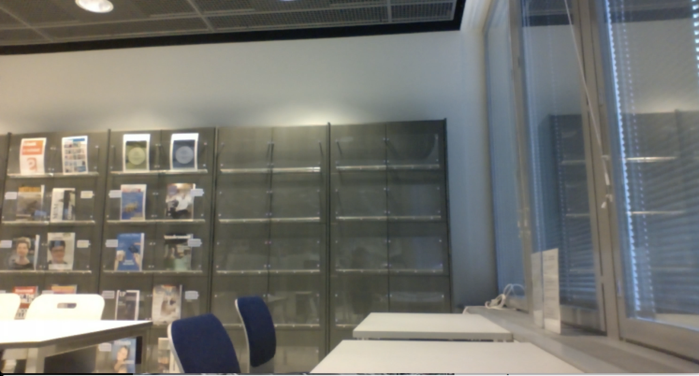
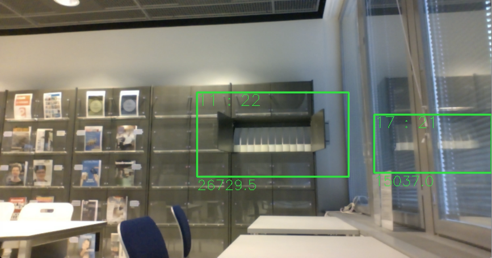
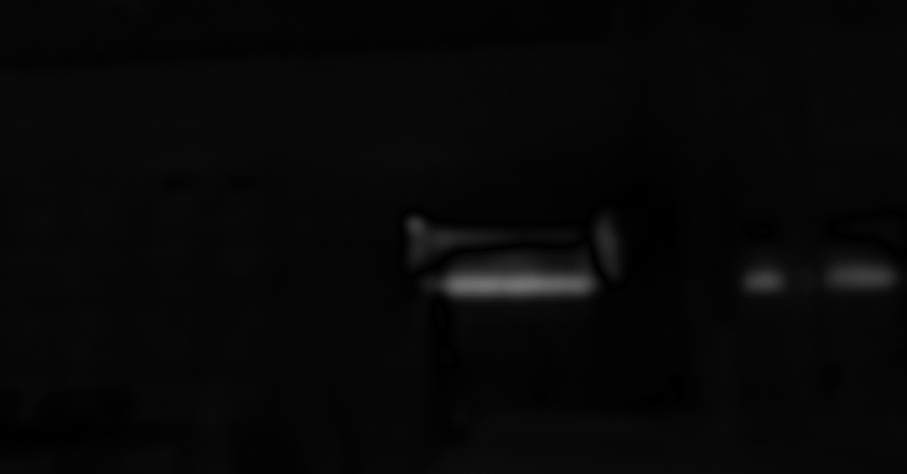

# Thesis - Fall detection - Work in progress

This is Kim Salmi's thesis for Haaga-Helia UAS. The thesis proposes an automatic monitoring system for formal and informal home care patients and care centers. It will provide security and a feeling of safety by detecting when a resident fall. After the detection the system will be able to alert professional personnel or family. The system should be affordable and should not be significantly less accurate than other available options.

* Working title: Improving safety for home care with a low cost computer vision embedded solution thus letting the aging generation live longer at home
* Name: Kim Salmi
* E-Mail: kim.salmi[at]iki.fi
* Student number: a1204035
* Supervisor: Tero Karvinen
* Haaga-Helia University of Applied Sciences, Finland
* Project website: <http://tunn.us/arduino/falldetector.php>

- - -

# Table of Contents - Suggestion

* 1 Abbreviations
* 2 Introduction
	* 2.1 Background
	* 2.2 About this thesis
	* 2.3 Goals of the study
* 3 Theoretical frame
	* 3.1 Home care
	* 3.2 Active and Assistive living 
	* 3.3 Automatic monitoring
		* 3.3.1 Video analysis
			* 3.3.1.1 Terminology
			* 3.3.1.2 Non-adaptive backgrounding
			* 3.3.1.3 Adaptive backgrounding
			* 3.3.1.x ...
			* 3.3.1.x Fall detection
	* 3.4 Alert systems
	* 3.5 Current commercial field
* 4 Constructive research
	* 4.1 Execution
	* 4.2 Testing
	* 4.3 Outcome
* 5 Discussion
	* 5.1 Significance of the results
	* 5.2 Conclusion / Summary
	* 5.3 Further research suggestions
* 6 References
	* 6.1 Publications
	* 6.2 Websites
* 7 Appendix
	* 7.1 Timetable for the thesis
	* 7.2 Interview
	* 7.3 Project plan - Linux project (ICT4TN018 Haaga-Helia course)

- - -

# Abbreviations

AAL - Active and Assistive living

ADL - Activities of daily living

ADL/IADL - ADL and IADL combined, ability to function at home

FD - automatic Fall Detecting and alerting system

IADL - Instrumental activities of daily living

VAAL - Video based solutions for Active and Assistive living

- - -

# Introduction

## Background

The year 2012 world population was 7.2 billion. In the year 2100 population is estimated to be between 9.0 and 13.2 billion people (Gerland, Ratrely, et al. 2014). In the beginning of the 20th century life expectancy was perhaps 30 years, a hundred years later it has raised to 65 years (Cohen 2003, 1173-1174). The decline of child mortality (death under 5-year old) has a big impact on life expectancy but without child mortality life expectancy has also increased significantly. Higher ages mortality patterns have also changed. Today a 50-year old is expected to live over 20 years longer than in 1845. (Roser 2016) In the coming half century, as a result of these factors, we will see dramatic population aging. By year 2050 the global fraction of population aged 65 years or older will rise from 7% (year 2010) to 16% (Cohen 2003, 1173-1174). In the year 2050 we will have four times more over 60 years old year than in the year 2000. The rising amount of elderly population will generate stress in our health care system. (Ropponen 2012, 8) How will we be able to take care of the aging generations?

## About this thesis

This thesis proposes an automatic monitoring system for formal and informal home care patients and care centers. It will provide security and a feeling of safety by detecting when a resident fall. After the detection the system will be able to alert professional personnel or family. The system should be affordable and should not be significantly less accurate than other available options. Further in this thesis the system will be called automatic Fall Detecting and alerting system (FD).

This thesis consist of two parts. The first part will cover the theoretical frame. The theoretical frame will give necessary background information from the health care perspective for understanding the need for automatic monitoring in general. It will also cover the technical part for automatic video analysis. The main topics will be home care, European Unions active and assistive living programme, video analysis in general, motion detection, human detection, fall detection and alert systems.

The goal of this project is to build a prototype that could be productized and commercialized. That is why the second part will not be publicly available. It will include the project plan, project tasks, task execution, testing and the outcome. Still there will be a stripped summary of the project outcome available.

## Goals of the study

The main idea is to create an embedded solution for improving the safety of patients at home care.

Research questions are:

- How to create a fall detection system to monitor home care patients?
	- How to create a software that detects falling
		- How to detect humans and track them
		- How to detect falling or collapsing
		- Can it be done with just one camera or is more needed?
	- What are the current systems on the market?
	- How to keep the system unit cost low (< 200€)
		- How to save computational resources
	- How to handle the privacy?

- - -

# Theoretical frame

## Home care

Home care is one solution for easing the stress for the health care system. It is a supportive care provided to people with special needs at their home. Depending on the need, home care can be provided multiple times a day and in many countries it is available around the clock. (Sanerma 2009, 43) The concept has grown considerably. The practice is helping the society by minimizing hospital care by moving the action to the home of the patient. Home care can also be assumed to increase the patients quality of life and maintenance of independence. (Thome, Dykes, Hallberg 2003, 860; Sanerma 2009, 64-66)

The home care term is used for **formal care**; *home care which is provided by professionals* and **informal care**; *home care which is provided by non-professionals*. Formal care can also be defined as home health care. Informal care can also be defined as domiciliary care, non-medical care or custodial care. Informal care is usually provided by family or friends. The definitions is dependent on the countries health care system and their common practices. (Sanerma 2009, 41-45) Further in this research the terms informal care and formal care will be used. The term home care will be used as a umbrella for both informal care and formal care.

Formal care can be divided in four different categories. *Practical* - Preparing food, cleaning and shopping. *Personal* - Personal hygiene and helping the patient get dressed. *Monitoring / supervision* - Monitoring patients suffering from dementia. *Care / Case management* - Coordinating the patients services. The needed formal care is determined by measuring *activities of daily living* (ADL) and *instrumental activities of daily living* (IADL). ADL contains eating, personal hygiene, putting on clothes and transferring (in the house). IADL contains preparing meals, housework, managing medications and managing finance. (Sanerma 2009, 43, 71) Patients usually rate their abilities to function at home (ADL/IADL) higher than the professional care takers would. Only the fear of falling is a bigger concern for patients than the professionals would rate it. (Morrow-Howell, Proctor & Rozario, 2001, 729-731)

There are many technological solutions available for patients living at their home. Monitoring and security solutions can be utilized by family and professional care takers. There should always be the patients consent before bringing such equipment to their home. Patients privacy should be respected when they open their home to others. (Cardinaux, Bhowmik, Abhayaratne & Hawley 2011, 11-12; Sanerma 2009, 64-66; Stengård 2011, 18) Patients with memory disorders can have problems adapting to new things in their home. Foreign objects and strange environment usually cause anxiety. Therefore it is crucial to install such equipment there before the patients memory is starting to fail. (Kotilainen, Topo, Hurnasti 2009, 106-112; Stengård 2011, 17-18)

Sanerma (2009, 64-75) and Stengård (2011, 38-42) agree that one of the big problems in home care with is that care takers do not have enough time for each patient. Could automatic monitoring free resources for the care takers?

## Active and Assistive living

European Union (EU) has noticed the growth of life expectancy and the problems it will bring to the health care system. EU/European Commission have established funding programs to support research and global competitiveness since 1984, currently in the European Research Area (ERA). The funding programs are called Framework Programmes for Research and Technological Development and currently run at phase eighth. Horizon 2020 or Framework Programme 8 (FP8) is currently in progress with an estimated budget of 80 billion euros. (Grove 2011) One of the funded projects is Active and Assistive Living (AAL).[^1] With a 700 million euros budget, AAL is trying to enhance the quality of life for the older people while improving the industry in Europe with the help of technology. (AAL - Active and Assistive Living programme 2016) Industry and research has shown growing interest in video based solutions for AAL (VAAL). Technology has evolved to a state that products are being commercialized. (Cardinaux, Bhowmik, Abhayaratne & Hawley 2011)

*Here I'm going to write about their research, projects and results*

[^1]: Renamed in 2014 when FP8 started. A lot of the literature references to the old name Ambient Assisted Living (AAL) Joint Programme (2008-2013).

## Automatic monitoring

When elderly people fall it is particularly serious and often leads to injury or death. That is why automatic monitoring has an important role in home care and care centers. (Kroputaponchai, Suvonvorn 2013, 1) The fear of falling leads to restricted ADL/IADL. The fear is justified, fall related injuries are among the five most causes of death for the elderly population. If falls would be detected the patient could be provided with in-time medical treatment. (Lin, Ling 2007, 1172) In-time medical treatment could save lives. The presence of personnel brings an elderly patients the feeling of safety (Sanerma 2009, 71). Could the presence of an automatic fall detecting system also lower the fear and therefore increase ADL/IADL?

Traditional surveillance systems need an operator to track activities with a video displaying multi-monitor setup. All the recording occur centralized and there is a complete lack of privacy. There need to be a paid operator watching the screens over the surveillance period. On top of this there is a study showing that after 22 minutes the operator will miss 95% of the activities on the screen. (Fleck & Straßer 2010. 986)

One of the biggest concerns for the patients is about how they preserve their privacy. Some of them are not agreeable with installation of cameras and sensors in their home. The main concern is the loss of privacy and particularly in solutions that includes cameras. (Cardinaux, Bhowmik, Abhayaratne & Hawley 2011, 11) This is why the privacy concerns, in such a system, should be taken seriously.

There are different technologies available for processing video material in a secure way. The video can be filtered and obscured so that identities or activities can not be recognized. A silhouette can be placed over the humans in the video so that they can not be identified. (Cardinaux, Bhowmik, Abhayaratne & Hawley 2011, 11-12)

For the reasons presented above the proposed solution will be a smart camera system. A smart camera system is a privacy respecting solution. In the system there are multiple camera nodes. Each camera node can analyze the video automatically and detect falls. The cameras will not transfer the video to any centralized system and thus preventing loss of privacy. (Fleck & Straßer 2010. 986-987) If the camera detects a fall it will alarm the personnel or family. The alarm can be made with different solutions and are discussed further later in this thesis.

### Video analysis

Video analysis can be made with a lot of different methods. Usually the interesting part of a scene is not the background but the objects in the foreground. These objects of interest could be any object, e.g. humans, cars, animals etc. *Foreground detection* is a method where objects of interest are separated from the background in a video stream. This method can also be called *background subtraction*. Further in this thesis both terms will be used. Background subtraction works by thresholding the error between the current image and the estimate of the image without the objects of interest. (Xu, et al. 2016; Chan, Mahadevan, Vasconcelos 2010; Stauffer & Grimson 1999) Faster computers have enabled researchers to propose robust models that are more complex than the previous methods. Backrounding methods can be categorized into pixel-based, region-based and hybrid methods. Every method has its own strength and weakness. (Xu, et al. 2016; Vacavant & Sobral 2013; Stauffer & Grimson 1999) In this thesis we can not cover every available algorithm but we will discuss the most significant. Basic terminology of the methods will be discussed next.

#### Terminology

**rewrite**

A video consists usually of a series of bitmap digital images that are called frames. Each frame consists of a matrix of pixels. In a binary image each pixels has 1-bit of information indicating either foreground or background (black or white, 0 or 1). A grayscale image could have an 8-bit number for each pixel indicating how bright it is. Color images usually use RGB colorspace indicating values for red, green and blue separately.

HSV, HSL etc..

**/rewrite**

#### Non-adaptive backgrounding

If the background of a scene remains unchanged the detection of foreground objects would be easy (Vacavant & Sobral 2013; Langanière 2011, 266-277). Let us assume that each frame is converted to a grayscale image before it is processed. Basically a frame (I), at the time (t), when there is no foreground objects in the scene (empty room, road without cars) is declared as the *background model* and then each pixel value (P) is compared to the pixel value at the same coordinate (x, y), in the frame, at a specific time. Each pixel that is different from the background model would be declared as foreground (F). In Fig. 1 let us assume the first frame (t=0) has no foreground objects.

> P[F(x,y,t)] = P[I(x,y,t)] - P[I(x,y,0)]

Fig. 1 - Static Frame Difference

In a real life scenario pixel values in the background would not be exactly the same in each frame because of changes in illumination, dynamic background, shadows and video noise (Xu et al. 2016; Stauffer & Grimson 1999; Langanière 2011, 266-277). An attempt to fix this could be thresholding. If the absolute difference between pixels is greater than the threshold, it is declared as foreground. (Fig. 2)

> P[F(x,y,t)] = |P[I(x,y,t)] - P[B(x,y,0)]| > Threshold

Fig. 2 - Static Frame Difference with threshold

Here is an example of *traditional backgrounding* or *non-adaptive backgrounding*. We have Fig. 3 as a background model and we calculate pixel value the difference from Fig. 4. (do not mind the green boxes) with a threshold. The result is shown in Fig. 5 and then the green boxes in Fig. 4 are drawn. In this example we see a problem with the reflection from the window, it is declared as foreground (Fig. 4). If the threshold is too low it will create *false negative* outputs and if it is too high it will create *false positive* outputs.

Fig. 3 - Empty room

Fig. 4 - Closet opened

Fig. 5 - Closet threshold

Non-adaptive backgrounding has other challenges too, it needs re-initialization (updating of the entire background model) or otherwise changes in the background is detected as foreground. These problems make non-adaptive backgrounding only useful in highly-supervised tracking applications. (Stauffer & Grimson 1999) The re-initialization could be avoided by using the previous frame as the background model (Fig. 6), but this fails if the foreground object suddenly stops (Vacavant & Sobral 2013).

> P[F(x,y,t)] = P[I(x,y,t)] - P[I(x,y,t-1)]

Fig. 6 - Frame Difference (without threshold)

#### Adaptive backgrounding

Modern background subtraction solutions are expected to be robust. Robust solutions should handle objects overlapping, shadows, lightning changes, moving background elements, objects of interest entering or leaving the scene, even when they are slow-moving. Traditional approaches usually fail in these conditions. (Chan et al. 2010; Stauffer & Grimson 1999)

*Adaptive backgrounding* is a method where the background model is created using averaging images over time. (Fig. 7) This method is effective where objects move continuously and the background is visible a significant portion of the time. This is not a robust solution because slowly moving objects are adapted to the background model and thus lost from the foreground. This solution also recovers slowly, can not handle bimodal backgrounds and has just one predetermined threshold for the whole image. (Stauffer & Grimson 1999)

> P[F(x,y,t)] = P[I(x,y,t)] - P[mode(I(x,y,t-1) .. I(x,y,t-n))]

Fig. 7 - Adaptive backgrounding (without threshold)

Generally all the modern algorithms share the same pattern (Vacavant & Sobral 2013): 

1. *Background initialization*: Creating the background model from a fixed number of frames
2. *Foreground detection*: Comparing the background model to the current frame or frames
3. *Background maintenance*: Teaching / updating the background model. Return to step 2.

Successful early work in the field on human tracking was made by Wren et al. (1997) who proposed *PFinder* ("person finder"). In this method the background model is a single Gaussian per pixel and the tracked object have a multi-class statistical model (Wren et al. 1997) This has been proved to be a good background subtraction method (Vacavant & Sobral 2013; Stauffer & Grimson 1999).

**brainstorming**

> Bi- or multimodal backgrounds

> Because the environment can change, both short term and through out the lifetime of the vision system, background subtraction algorithms are expected to be robust. One approach, that has gained substantial popularity, was first introduced by Stauffer and Grimson.
> (Chan, Mahadevan, Vasconcelos 2010)

**/brainstorming**

**Choosing the algorithm**

* Stauffer et al. Gaussian mixture model (GMM), 1999
* Elgammal et al. Kernel denisty estimator (KDE) 2000
* Kim et al. inspired from Kohonen proposed CodeBook 2004
* Zivkovic improved GMM with Adaptive Gaussian mixture model (AGMM) 2006
* Wang et al. Consensus-based method (SACON) 2007
* Maddalena and Petrosino a self-organizing background subtraction method (SOBS) 2008
* Barnich and Droogenbroeck a universal background subtraction algorithm (Vibe) 2011
* Hoffmann et al. Pixel-based adaptive segmenter (PBAS) 2012

(Xu et al. 2016)

#### Challenges in backgrounding

**Illumination**

- Robust system should handle illumination changes that are progressive and also sudden illumination changes eg. clouds block sunlight or lights are turned off.
- RGB color space is sensitive to illumination changes.
- HSV (SOBS)
- Normalized color space (SACON)
- CodeBook uses a color model to perform a separate evaluation of color distortion and brightness distortion.
- Long and short term background model combined (KDE) => sensitive detection and low false positive rate

(Xu et al. 2016)

**Dynamic background**

**Shadows**

**Video noise**

(Xu et al. 2016)

**/brainstorming**

#### Fall detection

### Alert systems

*Going to write about what solutions are available?*

### Current commercial field

*Going to write about what solutions are available on the current market*

* Seniortek (Kukkatolppa)
* Terveysoperaattori (OMAsensori)
* ..

- - -

# Constructive research 

This thesis consist of two parts. This is the second part of the thesis.

## Execution

## Testing

## Outcome

- - -

# Discussion

## Significance of the results

The idea of the project is to lower health care costs and provide safer home care for the aging generation. How much the solution could save is not yet relevant and will not be in the scope of the project.

## Conclusion / Summary

## Further research suggestions

- - -

# References

### Publications

[Cardinaux F., Bhowmik D., Abhayaratne S. & Hawley M. S. 2011. Video Based Technology for Ambient Assisted Living: A review of the literature. Journal of Ambient Intelligence and Smart Environments 3(3), pp. 253-269](https://www.researchgate.net/publication/220497491)

[Chan A. B., Mahadevan V., Vasconcelos N. 2010. Generalized Stauffer–Grimson background subtraction for dynamic scenes. Machine Vision and Applications (2011) 22 pp. 751–766](http://visal.cs.cityu.edu.hk/research/dytexbkgnd/)

[Cohen J. E., et al. 2003. Human Population: The Next Half Century. Science, VOL 302, pp. 1172-1175.](http://citeseerx.ist.psu.edu/viewdoc/download?doi=10.1.1.453.3842&rep=rep1&type=pdf)

[Fleck S., Straßer W. 2010. Privacy Sensitive Surveillance for Assisted Living - A Smart Camera Approach. pp. 985-1014. Handbook of Ambient Intelligence and Smart Environments. Part VIII. Springer US. ISBN 978-0-387-93808-0](http://www.springer.com/gp/book/9780387938073)

[Gerland P., Raftery A. E., Sevcikova H., Li N., Gu D., Spoorenberg T., Alkema L., Fosdick B. K., Chunn J., Lalic N., Bay G., Buettner T., Heilig G. K., Wilmoth J. 2014. World population stabilization unlikely this century. Science VOL 346 (6206), pp. 234-247](http://science.sciencemag.org/content/346/6206/234)

Kotilainen H., Topo P., Hurnasti, T. 2009. Asuinympäristö, apuvälineet ja teknologia. Teoksessa Sormunen S. & Topo P.(toim.) Laadukkaat dementiapalvelut – opas kunnille. Jyväskylä. Gummerus Kirjapaino Oy.

[Kroputaponchai T., Suvonvorn N. 2013. Vision-based Fall Detection and Alert System Suitable for the Elderly and Disabled Peoples](https://www.researchgate.net/publication/239928029_Vision-based_Fall_Detection_and_Alert_System_Suitable_for_the_Elderly_and_Disabled_Peoples)

Langanière R. 2011. OpenCV 2 Computer Vision Application Programming Cookbook. Packt Publishing Ltd. ISBN 978-1-849513-24-1

[Lin C., Ling Z, 2007. Automatic Fall Incident Detection in Compressed Video for Intelligent Homecare. Proceedings of 16th International Conference on Computer Communications and Networks, 2007. ICCCN 2007, pp. 1172-1177](https://www.researchgate.net/publication/224721605_Automatic_Fall_Incident_Detection_in_Compressed_Video_for_Intelligent_Homecare)

[Morrow-Howell N., Proctor E. & Rozario P. 2001. How Much Is Enough? Perspectives of Care Repients and Professionals on the Sufficiency in In-Home Care. The Gerontologist 41, pp. 723–732.](http://gerontologist.oxfordjournals.org/content/41/6/723.long)

[Ropponen A. 2012. An Arrangement to Locate and Identify People with Dual-Frequency Tags Providing Context-Related Information. ISBN 978-952-60-4871-0](http://urn.fi/URN:ISBN:978-952-60-4871-0)

[Sanerma P. 2009. Kotihoitotyön kehittäminen tiimityön avulla. ISBN 978-951-44-7855-0](http://urn.fi/urn:isbn:978-951-44-7855-0)

[Stauffer C., Grimson W. E. L. 1999. Adaptive Background Mixture Models for Real-Time Tracking. IEEE Computer Society Conference on Computer Vision and Pattern Recognition. pp. 246–252](https://www.researchgate.net/publication/215722011_Adaptive_Background_Mixture_Models_for_Real-Time_Tracking)

[Stengård M. 2011. Muistisairaiden kotihoito ja sen kehittäminen. Satakunta University of Applied Sciences.](http://urn.fi/URN:NBN:fi:amk-201105117456)

[Thome B., Dykes A-K., & Hallberg I. 2003. Home Care with Regard to Definition, Care Recipients, Content and Outcome: Systematic Literature Review. Journal of Clinical Nursing. Vol 12. pp 860-872.](http://onlinelibrary.wiley.com/doi/10.1046/j.1365-2702.2003.00803.x/abstract)

[Wren C., Azarbayejani A., Darrell T., Pentland A. 1997. Pfinder: real-time tracking of the human body. IEEE Transactions on Pattern Analysis and Machine Intelligence 19 (7). pp. 780–785.](http://dx.doi.org/10.1109/34.598236)

[Xu Y., et al. 2016 Background modeling methods in video analysis: A review and comparative evaluation. CAAI Transactions on Intelligence Technology (2016).](http://dx.doi.org/10.1016/j.trit.2016.03.005)

### Websites

AAL - Active and Assistive Living programme, 2016. About. <http://www.aal-europe.eu/about/> Accessed: 16.3.2016

European Comission. What is Horizon 2020? <http://ec.europa.eu/programmes/horizon2020/en/what-horizon-2020> Accessed: 16.3.2016

Grove J. 2011. 'Triple miracle' sees huge rise in EU funds for frontier research. Times Higher Education. <https://www.timeshighereducation.com/news/triple-miracle-sees-huge-rise-in-eu-funds-for-frontier-research/416952.article?storycode=416952> Accessed: 17.6.2016

Roser M., 2016 – Life Expectancy. OurWorldInData.org. Data taken from the Human Mortality Database. University of California, Berkeley (USA), and Max Planck Institute for Demographic Research (Germany) <https://ourworldindata.org/life-expectancy/> Accessed: 7.6.2016

- - -

# Appendix

## Timetable for the thesis

The thesis will contain one core project and the theoretical frame around that subject.

* Week 3 - 10
	- Building a Prototype (BUS4TN007 Haaga-Helia course)
		- First prototype of the product
	- Reviewing the Literature
* Week 11
	- Writing the thesis plan
* Week 12
	- Python programming (SWD8TF808 Haaga-Helia course)
		- Supporting the product development
* Week 13-21
	- Studying to the entrance examination for The University of Helsinki, Faculty of Law
	- Linux project (ICT4TN018 Haaga-Helia course)
		- Enhance the original prototype
* Week 22-26
	- Writing the theoretical frame
		- Video analysis
			- Detection algorithms
* Week 27-30
	- Product development
		- Motion detection algorithms
		- Adapting different fall detecting algorithms
		- Testing -> live testing for a few months(?)
	- Writing about the product development
	- Product testing
	- Writing about the tests
	- Finishing the thesis

- - -

## Interview

*Iterviewing for information of the current market*

- - -

## Project plan - Linux project (ICT4TN018 Haaga-Helia course)

* Code delivery on due date to Github

* Week 14 (due date 8.4)
	- Adapting: tracking object saving (2-4h)
	- Result: Ability to track multiple objects in video
	- DoD: Can track two different objects and separate them

* Week 15 (due date 15.4)
	- Adapting: tracking object not moving algorithm (2-4h)
	- Result: Ability to detect a person laying down or not moving
	- DoD: Will be able to tell when a object has not moved over the threshold movement in threshold time

* Week 16 (due date 22.4)
	- **Optional, time can be spent on earlier tasks if needed**
	- Adapting: fall detection algorithm(s) (6-8h)
	- Result: Ability to detect falls
	- DoD: Is able to detect over 90% of the falls in the video stream.

* Week 17 (due date 29.4)
	- Testing (4h)
	- Result: Ability to show results of the product
	- DoD: Tested with at least 10 cases. Test results documented.
	- Finishing the product for the presentation

- - -